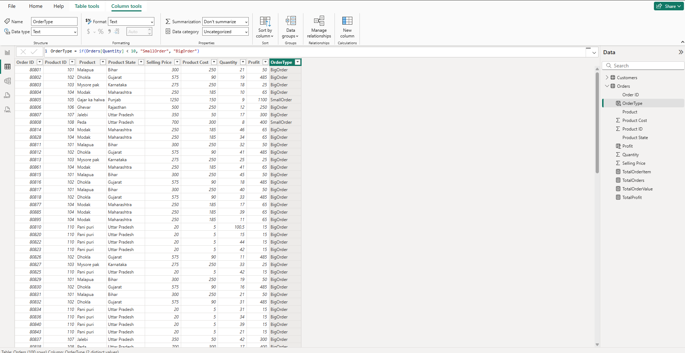
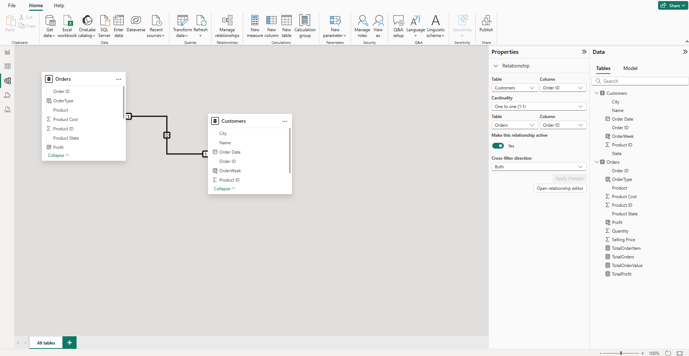

# Power BI DAX Queries

This repository contains practice work on DAX queries using Power BI, with sample data sourced from Excel files. The project demonstrates the creation of calculated columns and measures using various DAX functions such as `COUNT()`, `SUM()`, and `IF()`. It also includes screenshots of the Report View, Table View, and Model View from Power BI.

## Data Sources

- **[DAX Customers.xlsx](DAX%20Customers.xlsx)**: Contains customer data used for analysis.
- **[DAX Orders.xlsx](DAX%20Orders.xlsx)**: Contains order data linked to customers.

## Power BI File

- **[DAX-Queries.pbix](DAX-Queries.pbix)**: Power BI project file with all queries, calculated columns, and measures.

## DAX Functions Practiced

- `COUNT()`
- `SUM()`
- `IF()`
- And more...

## Views

Below are screenshots from the Power BI project:

### Report View

### Table View

### Model View

## Getting Started

1. Clone this repository.
2. Open the `DAX-Queries.pbix` file in Power BI Desktop.
3. Ensure the Excel files are in the same directory for data connectivity.

## License

This project is for educational and demonstration purposes.
